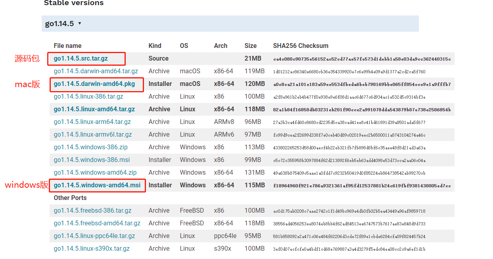
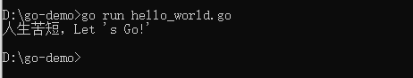
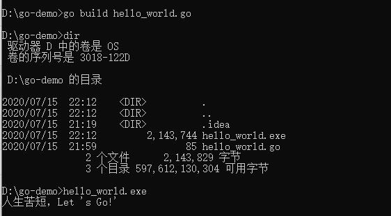

## Go 语言学习 day01 by [xiajibaxie](https://github.com/xiajibaxie)

### 环境安装

#### [go 语言下载地址](https://golang.org/dl/)

#### [GoLand 下载地址](https://www.jetbrains.com/go/download/#section=windows)




#### windows下安装

默认情况下会安装到 `C:\Go` 目录下，将 `C:\Go\bin` 目录添加到 `Path` 环境变量中。

添加环境变量后重新打开命令行并输入 `go version` 显示版本则安装成功。


#### 运行第一个 go 语言程序

编辑 `hello_world.go` 文件，内容如下：

```go
package main
import "fmt"

func main() {
	fmt.Println("人生苦短，Let 's Go!'")
}
```


命令行执行 `go run hello_world.go`



还可以在命令行执行命令 `go build hello_word` 生成二进制文件。



